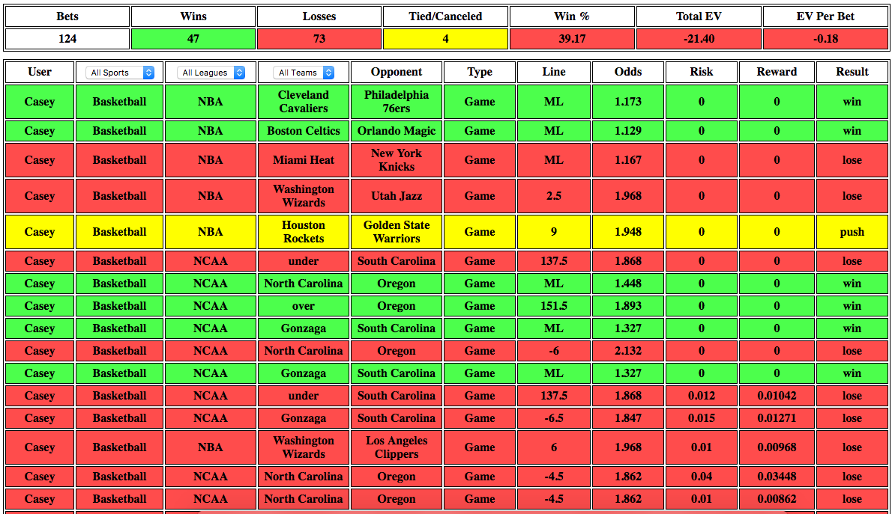

# whatsmyedge

[http://www.lesredfield.com/whatsmyedge/][edge]

[edge]: http://www.lesredfield.com/whatsmyedge/

## Features

whatsmyedge is a bitcoin wagering performance analysis tool built with Javascript.

It allows users of the bitcoin wagering site nitrogensports.eu to view performance metrics segmented by different wager types, and compare the efficiency of their wagering to that of their peers.

Since different wagers have different risk and reward, win percentage alone is not sufficient for analyzing and comparing performances. The expected value ('EV') and expected value per wager ('EV Per Bet') metrics are a way to compare efficiency between favorite and underdog wagers.

The tool also allows users to view segmented statistics for specific sports, leagues, and teams. Curious whether you're a better Knicks handicapper than your friends? whatsmyedge has the answer.
